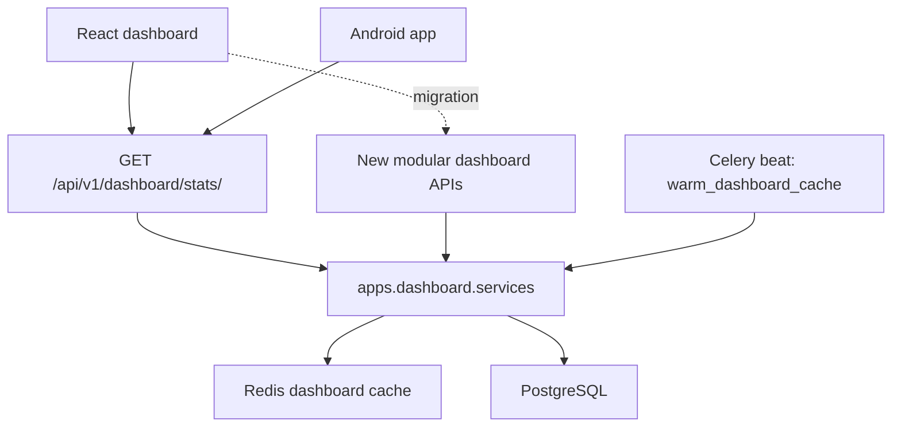

# Dashboard Performance and Authentication Architecture

## Current Architecture



## Dependency Map

Dashboard API -> `DashboardAnalyticsService` -> summary/trend/branch services -> Django ORM -> PostgreSQL

`/dashboard/summary/` -> `DashboardSummaryService` -> `CallLog`, `DeviceHealth`, `Device`, `LeadManagement`, `Branch`, `Contact`, `User`, `ExportJob`

`/dashboard/devices/` -> `DashboardDeviceService` -> `Device`, `DeviceHealth`

`/dashboard/branches/` -> `DashboardBranchService` -> `Branch`, `CallLog`, `LeadManagement`

`/dashboard/trends/` -> `DashboardTrendService` -> `CallLog`

`/dashboard/users/` -> `DashboardUserService` -> `User`

`/dashboard/contacts/` -> `DashboardContactService` -> `Contact`, `CallLog`

`/dashboard/exports/` -> `DashboardExportService` -> `ExportJob`

## Legacy Field Map

| Field | Source function | Table/model | Query shape | Cache | Used by |
|---|---|---|---|---|---|
| `total_calls` | `DashboardSummaryService._calculate` | `call_logs` | `COUNT(id)` with branch/date/source filters | Yes, 45s | React + Android |
| `active_devices` | `DashboardSummaryService._calculate` | `device_health` | `COUNT(id)` where `is_online=True` | Yes, 45s | React + Android |
| `total_devices` | `DashboardSummaryService._calculate` | `devices` | `COUNT(id)` with branch filters | Yes, 45s | React + Android |
| `missed_calls` | `DashboardSummaryService._calculate` | `call_logs` | filtered aggregate on `call_type='missed'` | Yes, 45s | React + Android |
| `total_leads` | `DashboardSummaryService._calculate` | `lead_management` | `COUNT(id)` with branch/source filters | Yes, 45s | React + Android |
| `total_branches` | `DashboardSummaryService._calculate` | `branches` | `COUNT(id)` active, not deleted | Yes, 45s | React |
| `total_contacts` | `DashboardSummaryService._calculate` | `contacts` | `COUNT(DISTINCT id)` with call-log branch join | Yes, 45s | React |
| `total_users` | `DashboardSummaryService._calculate` | `accounts_user` | `COUNT(id)` active users | Yes, 45s | React |
| `total_exports` | `DashboardSummaryService._calculate` | `export_jobs` | `COUNT(id)` with user branch filters | Yes, 45s | React |
| `today_*_calls` | `DashboardSummaryService._calculate` | `call_logs` | filtered aggregate for today by call type | Yes, 45s | React + Android |
| `avg_duration` | `DashboardSummaryService._calculate` | `call_logs` | `AVG(duration)` | Yes, 45s | React |
| `call_volume_trends` | `DashboardTrendService._calculate` | `call_logs` | `GROUP BY TruncDate(call_time)` for last 7 days | Yes, 60s | React |
| `branch_performance` | `DashboardBranchService._calculate` | `branches`, `call_logs` | branch annotate counts by call type | Yes, 60s | React |

Execution time is now logged per segment through `profile_segment`. Add `?profile_sql=1` to any dashboard endpoint, or set `DASHBOARD_PROFILE_SQL=true`, to log SQL count and each SQL statement with timing.

## Slow Query Report

Static analysis found the former `/stats/` endpoint performed many separate counts plus two grouped aggregations in one request. The highest-risk queries are:

| Area | Risk | Fix implemented |
|---|---|---|
| Summary cards | duplicate independent counts | grouped call aggregates and isolated modular summary API |
| Branch performance | expensive grouped join from branches to call logs | isolated `/dashboard/branches/`, cached 60s |
| Trends | date truncation over call logs | isolated `/dashboard/trends/`, cached 60s |
| Contacts | distinct contact count through call logs | isolated `/dashboard/contacts/`, cached 60s |
| Call type filters | branch/date/type scans | added `calllog_branch_type_time_idx` |

Run staging checks with:

```sql
EXPLAIN ANALYZE
SELECT branch_id, call_type, count(*)
FROM call_logs
WHERE branch_id = '<branch-id>' AND call_time >= now() - interval '7 days'
GROUP BY branch_id, call_type;
```

## New APIs

The old endpoint is unchanged:

`GET /api/v1/dashboard/stats/`

New additive v1 endpoints from the first migration slice:

`GET /api/v1/dashboard/summary/`
`GET /api/v1/dashboard/devices/`
`GET /api/v1/dashboard/branches/`
`GET /api/v1/dashboard/trends/`
`GET /api/v1/dashboard/users/`
`GET /api/v1/dashboard/contacts/`
`GET /api/v1/dashboard/exports/`

Version 2 endpoints are available behind `ENABLE_DASHBOARD_V2`:

`GET /api/v2/dashboard/summary/`
`GET /api/v2/dashboard/devices/`
`GET /api/v2/dashboard/branches/`
`GET /api/v2/dashboard/trends/`
`GET /api/v2/dashboard/users/`
`GET /api/v2/dashboard/contacts/`
`GET /api/v2/dashboard/exports/`

## Feature Flags

| Flag | Default | Effect |
|---|---:|---|
| `ENABLE_DASHBOARD_V2` | true | Enables `/api/v2/dashboard/*` routes |
| `ENABLE_REDIS_CACHE` | true | Enables dashboard cache reads/writes and invalidation |
| `ENABLE_BACKGROUND_ANALYTICS` | false | Enables Celery refresh of `dashboard_statistics` and summary reads from the table |
| `ENABLE_REFRESH_ROTATION` | true | Controls SimpleJWT refresh rotation and blacklist after rotation |
| `ENABLE_DEVICE_SESSIONS` | true | Enables `user_device_sessions` writes and revocation updates |
| `ENABLE_SQL_PROFILING` | false | Logs dashboard SQL query count and SQL details |
| `ENABLE_API_OBSERVABILITY` | true | Records scoped API request metrics and slow SQL |

## Background Statistics

The additive table `dashboard_statistics` stores daily branch dashboard metrics:

`branch`, `date`, `incoming`, `outgoing`, `missed`, `total_calls`, `active_devices`, `total_devices`, `total_contacts`, `total_users`, `total_leads`, `total_exports`, `avg_duration`, `conversion_rate`.

Celery task `apps.dashboard.tasks.refresh_dashboard_statistics` updates the table every minute only when `ENABLE_BACKGROUND_ANALYTICS=true`. Summary APIs use this table only for simple today/default filters; unsupported filters fall back to live ORM queries to preserve correctness.

## Redis and Celery

Redis cache keys are per user, role, endpoint segment, and query parameters. Writes now use targeted invalidation:

| Write event | Invalidated segments |
|---|---|
| Call log | summary, trends, branches |
| Device/device health | summary, devices |
| Lead | summary |
| Branch | summary, branches |
| Contact | summary, contacts |
| Export | summary, exports |
| User | summary, users |

Celery beat warms the default dashboard cache every minute through `apps.dashboard.tasks.warm_dashboard_cache`.

## Authentication Architecture

Server settings now default to:

| Token | Lifetime | Behavior |
|---|---:|---|
| Access token | 30 minutes | Short-lived Bearer token |
| Refresh token | 90 days | Rotated on refresh |

Refresh token blacklist support is enabled. `POST /api/v1/auth/logout/` blacklists the submitted refresh token for single-session logout.

Android and React now save a rotated refresh token if `/auth/token/refresh/` returns one. This keeps automatic refresh working after blacklist enforcement.

Device sessions are stored in `user_device_sessions` with token hashes only. Additive endpoints:

`GET /api/v1/auth/sessions/`
`POST /api/v1/auth/sessions/logout-all/`

## Android Flow

Login -> store access + refresh in encrypted preferences -> request APIs with access token -> on 401 call `/auth/token/refresh/` -> store new access and optional new refresh -> retry original request -> logout only if refresh fails, user is disabled, device is removed, or user explicitly logs out.

## Deployment Plan

1. Deploy code with migrations to staging.
2. Run Django migrations, including SimpleJWT blacklist migrations and `calllog_branch_type_time_idx`.
3. Enable `DASHBOARD_PROFILE_SQL=true` only during controlled profiling windows.
4. Compare `/stats/` output before and after for the same users and query params.
5. Enable Celery beat cache warmer.
6. Enable `ENABLE_DASHBOARD_V2=true` and migrate React panels one endpoint at a time to `/api/v2/dashboard/*`.
7. Roll Android update that stores rotated refresh tokens before enforcing stricter token lifetimes in production.
8. Enable `ENABLE_BACKGROUND_ANALYTICS=true` after validating `dashboard_statistics` freshness.

## Rollback Plan

1. Route React back to `/api/v1/dashboard/stats/`.
2. Stop Celery beat entry `warm-dashboard-cache-every-minute`.
3. Set `ENABLE_DASHBOARD_V2=false`, `ENABLE_BACKGROUND_ANALYTICS=false`, and `ENABLE_SQL_PROFILING=false`.
4. Revert JWT lifetimes by setting `JWT_ACCESS_TOKEN_LIFETIME_MINUTES=43200` and `JWT_REFRESH_TOKEN_LIFETIME_DAYS=365` if older clients are still installed.
5. Drop the added call-log index only if it causes write overhead after measurement.

## Benchmark Procedure

Record p50/p95 for:

`/stats/`, `/summary/`, `/devices/`, `/users/`, `/contacts/`, `/trends/`, `/branches/`

For each endpoint, capture:

`elapsed_ms`, `sql_query_count`, slowest SQL statement, cache hit/miss, user role, branch filter, and date filter.

## Observability Layer

The platform now records request IDs and scoped API metrics for dashboard endpoints by default:

`/api/v1/dashboard/*`
`/api/v2/dashboard/*`

Every response includes `X-Request-ID`. Clients can also send `X-Request-ID` and the server will preserve it.

New tables:

| Table | Purpose |
|---|---|
| `api_request_metrics` | endpoint, status, duration, SQL count, cache hit/miss, request ID |
| `slow_queries` | SQL statements above `API_SLOW_QUERY_THRESHOLD_MS` |

New operational endpoints:

`GET /health/`
`GET /api/v1/monitoring/health/`
`GET /api/v1/monitoring/platform/summary/?minutes=60`
`GET /api/v1/monitoring/platform/requests/?limit=50`
`GET /api/v1/monitoring/platform/slow-queries/?limit=50`

Metrics are retained for `API_METRIC_RETENTION_DAYS` and cleaned hourly by `apps.monitoring.tasks.cleanup_observability_metrics`.

The React dashboard now includes `/monitoring` for endpoint latency, SQL pressure, cache hit rate, recent requests, slow queries, and health checks.
